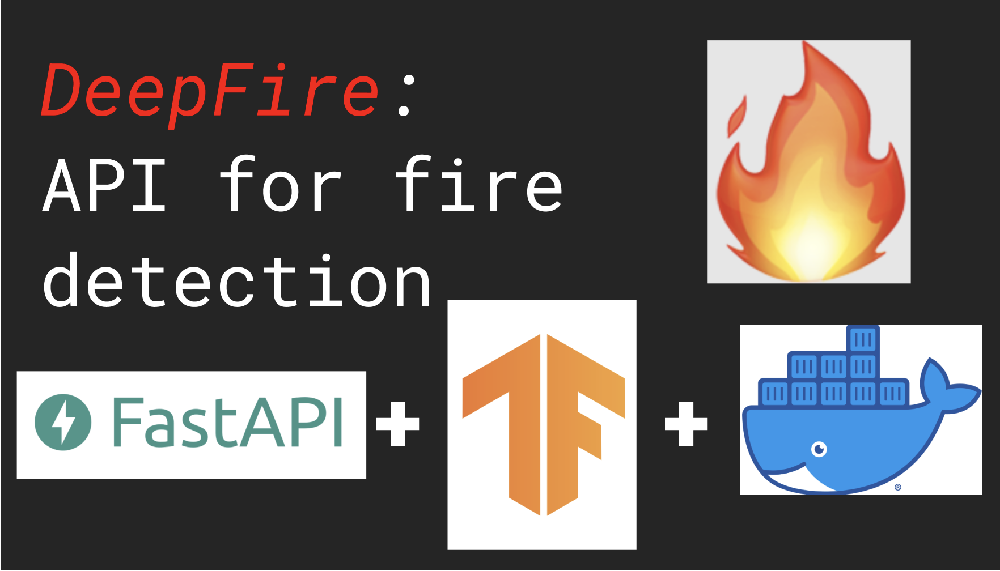

# DeepFire



An API for detecting fires in images using deep learning.

Deep learning has the power to potentially save millions of dollars (and more importantly, lives) in places like California where the annual "fire season" arrives every Fall.

We built this API to show how the technology can fight this and other crises, and inspire our students to do the same.

## Getting Started

### Use the API
To classify your own images, you can use the live API: use the link [here](https://fire-detection-api.herokuapp.com/docs) to read the documentation and send requests.

### Running Locally
You only need to use ONE of the following options:

#### Option #1: Using Docker
You can download this repository and run it using [Docker](https://www.docker.com/get-started):

```
$ docker-compose up
```

Then head over to [http://localhost:8000/docs](http://localhost:8000/docs) or [http://localhost:8000/redoc](http://localhost:8000/redoc) in the browser. Here is a screenshot exemplifying what you might see (specifically for [Redoc](https://redocly.com/redoc/)):
 


#### Option #2: Using Virtual Environments

Alternatively, you can also make a virtual environment. This is *recommended*, as it will allow you to also run the automated tests as well 
(discussed below). Here is the command to install the dependencies locally:

```
$ python3 -m venv env  
$ source env/bin/activate 
(env) $ python -m pip install -r requirements.txt
```
And then run the app using `uvicorn` in the Command Line:
```
(env) $ uvicorn app.main:app --reload  
```
Then head over to [http://localhost:8000/docs](http://localhost:8000/docs) or [http://localhost:8000/redoc](http://localhost:8000/redoc) in the browser.

### Run the Tests
To run the tests, you will first need to set up a Python virtual environment to run this project locally (see above). Then you can run the automated tests from the root directory, using the command line:
```
(env) $ pytest
```
If there are no failures, then you should be good to go!
You can inspect the code for the tests in `app/main_test.py` if you wish.
## The Data and the Model
The image dataset and neural network model used for the production API will be documented on the [Releases](https://github.com/UPstartDeveloper/Fire-Detection-API/releases) page of this repository.

## Making Your Own Deep Learning API
To customize this project for your own purposes, I'd recommend doing the following:

1. Configure the [config.yaml](./app/config.yaml) to download your particular model of interest. 
2. To edit the API metadata (including what appears on the UI), you may edit the values in [settings.py](./app/settings.py). For a more extensive list of the kinds of metadata you can change, please double check with the [FastAPI documentation](https://fastapi.tiangolo.com/tutorial/metadata/?h=meta).

## Credits and Resources
1. This *Towards Data Science* [blog](https://towardsdatascience.com/a-step-by-step-tutorial-to-build-and-deploy-an-image-classification-api-95fa449f0f6a) by Youness Mansar will give you a little more detail on how you can build a deployment-driven deep learning project (using the Google Cloud Platform's App Engine).
2. Another [blog](https://towardsdatascience.com/how-to-deploy-your-fastapi-app-on-heroku-for-free-8d4271a4ab9#beb1) by  Shinichi Okada in *Towards Data Science* will give more details how to deploy FastAPI applications (such as this repo!) on Heroku specifically.
3. If you're curious to know why we used `python -m pip` in the [Using Virtual Environments](#using-virtual-environments) section, please read this [explanation](https://snarky.ca/why-you-should-use-python-m-pip/) to see how it differs from just using `pip`/`pip3`.
